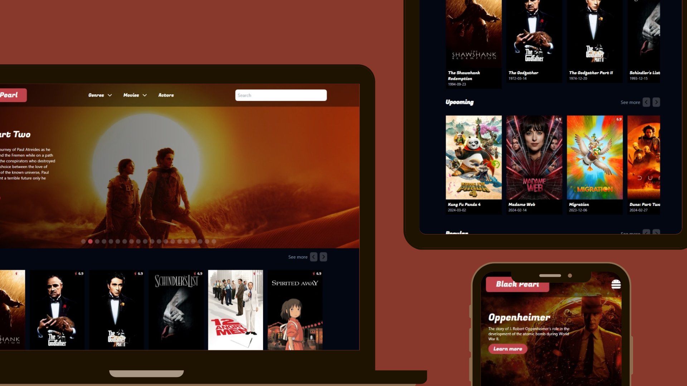

# Black Pearl Movie Project

## Table of Contents

- [Overview](#overview)
- [Features](#features)
- [Attribution](#attribution)

## Overview

This project is part of [**_Re:Coded_**](https://www.re-coded.com/) bootcamp, it meants to test our experience in **frontend** and **API**.

[**_Live Preview_**](https://black-pearl9.netlify.app/)

## Features

- Data provided by [**TMDB**](https://developer.themoviedb.org/docs/getting-started) API, with plenty of films, series, posters and trialers.
- Build with **Tailwind CSS** to provide responsive appealing-looking app for all screens.
- Utilizing **Next JS** as a frontend framework.

## Attribution

This project data are brought from [**TMDB**](https://developer.themoviedb.org/docs/getting-started) API.

